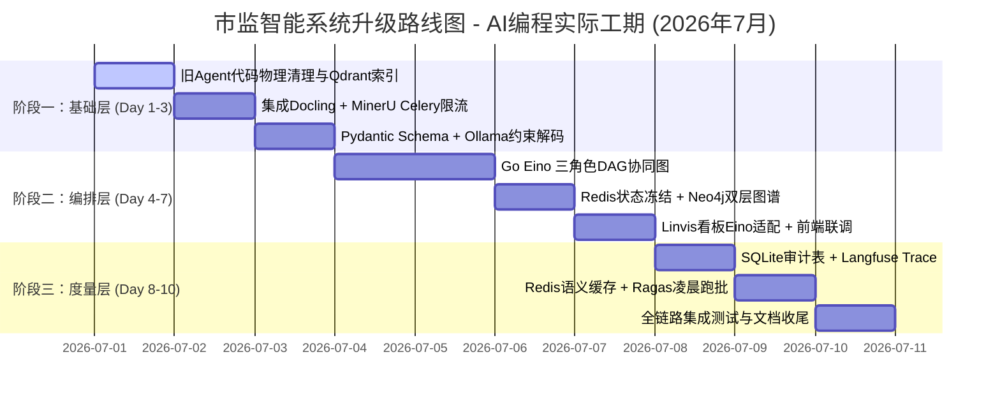

# 市监智能文档与填表系统升级计划 (第1部分)

## 一、 背景与升级目标
针对在 Gemini.google.com 上进行的 DeepSearch 深度技术分析与项目改进建议，结合本系统在市场监督管理（以下简称“市监”）局的真实业务场景（如：公文编写、行政处罚决定书起草、行政审批表格自动填充），我们拟定了一份详尽的技术升级计划。

升级旨在解决当前系统在以下几个方面的痛点：
1.  **复杂版面解析弱**：由于市监公文存在大量双栏公告、手写扫描件与跨行跨列复杂表格，当前 naive 纯文本分块极易丢失物理关联性。
2.  **填表格式易崩溃**：大模型生成结构化 JSON 表格数据时偶尔会出现 Markdown 包裹符号或字段类型错误，导致下游 .NET OpenXML 渲染出错。
3.  **缺乏合规审计与人机协同机制**：市监处罚决定生成是严肃的法律过程，大模型直接输出存在幻觉红线风险，必须建立“大小模型协同”与“人机审核中断复核”机制。
4.  **评测手段非量化**：缺乏客观度量 RAG 知识检索准确度与回答忠实度的工程手段。

---

## 二、 本地软硬件环境适配性评估 (48 GB 统一内存精确预算)

### 硬件规格
*   **设备**：MacBook Pro M4 Max (Mac16,5)，16 核 CPU（12 性能 + 4 能效），48 GB 统一内存
*   **核心模型**：Ollama `qwen3.6:35b-q4` 常驻 GPU，占用 ~21 GB，`keep_alive=Forever`
*   **Docker 容器**：GenRAG 全栈容器组（Server + Neo4j + Qdrant + Redis）~5 GB；另有 lawrag 独立项目容器组 ~3.4 GB（**严禁删除**，开发期可暂停）

### 48 GB 内存精确预算（生产运行态）

| 组件 | 占用 | 累计 |
| :--- | ---: | ---: |
| macOS + IDE + Chrome | ~8 GB | 8 GB |
| Ollama qwen3.6:35b-q4 (常驻) | ~21 GB | 29 GB |
| GenRAG Docker 全栈 | ~5 GB | 34 GB |
| lawrag Docker 容器 | ~3.4 GB | 37.4 GB |
| **空闲余量** | | **10.6 GB (22%)** |

### MinerU + 35B 大模型共存策略（不卸载大模型）

> [!IMPORTANT]
> 35B 模型永远不卸载。MinerU 采用 **Pipeline 后端 + MPS GPU 加速 + Celery 单并发**，峰值仅增 ~3 GB。

| 保险层 | 措施 | 效果 |
| :--- | :--- | :--- |
| ① Celery 单并发 | `concurrency=1`，同时最多解析 1 份文档 | 防止并行解析吃掉 6+ GB |
| ② Pipeline 后端 | 不用 VLM 后端（省 7-10 GB） | 峰值压在 3 GB |
| ③ 解析后回收 | 任务完成后 `torch.mps.empty_cache()` | 3 GB 及时归还 |
| ④ Chrome 控制 | 标签页 ≤ 5 个 | 防止浏览器偷吃 2-3 GB |

**峰值内存：40.4 GB (84%)，余量 7.6 GB，安全可控。**

### 各升级模块风险评级

| 升级模块 | 额外内存 | 风险 | 说明 |
| :--- | :--- | :--- | :--- |
| Docling 解析 | ~200 MB | 🟢 | 轻量 CPU 端运行 |
| MinerU Pipeline MPS | ~3 GB (临时) | 🟡 | Celery 单并发限流 |
| Ollama 约束解码 | 0 | 🟢 | Schema 掩码，无额外加载 |
| Go Eino 编排 | ~50 MB | 🟢 | Go 二进制极轻量 |
| Neo4j 双层图谱 | ~200 MB | 🟢 | 增量写入 |
| Redis 语义缓存 | ~100 MB | 🟢 | 复用 GenRAG-Redis |
| SQLite 审计表 | ~5 MB | 🟢 | 纯磁盘 I/O |
| Langfuse 容器 | ~400 MB | 🟡 | 部署时暂停 lawrag 容器腾内存 |
| Ragas 离线评测 | ~2-3 GB | 🔴 | 凌晨错峰执行 |

## 三、 核心功能设计与升级方案

### 1. 多源文档解析管线升级 (Docling + MinerU 异步分流)
为解决扫描件、双栏排版及复杂表格被截断破坏的问题，系统重构原有的纯文本分块逻辑，升级为**解析器无关的统一证据单元 (Evidence Units, EUs) 构建管线**：

```
                    [ 传入待解析文档 ]
                            │
              ┌─────────────┴─────────────┐
        (数字原生 PDF/DOCX)           (扫描件/无边框复杂表格)
              ▼                           ▼
         [ Docling 解析 ]            [ Celery 慢队列 MinerU ]
              │                           │
              └─────────────┬─────────────┘
                            ▼
              [ 统一映射为标准化语义节点 ] (如 section_header)
                            │
                            ▼
              [ 证据单元 (EUs) 关联并入向量库/Neo4j ]
```

*   **技术实现**：
    *   在 Python FastAPI 端引入 `Docling` 提取原生文档。
    *   针对复杂 PDF 扫描件或手写申报表格，发布异步任务到 Celery 慢速队列，使用 `MinerU` 进行视觉布局识别与跨行跨列表格提取。
    *   **语义映射**：将不同解析器输出的节点物理坐标与语义层级，统一映射为标准化节点（DoCO 本地语义表达），保证检索出的知识片段（Chunks）拥有极其完整、不被割裂的逻辑与空间关联。

---

### 2. 确定性表格填充与文书生成 (Pydantic + Ollama 约束解码)
市监执法流程要求所填写的表格数据（如企业社会信用代码、处罚金额、法定处罚种类）绝对符合预设的 Schema，不容许任何多余字符。

*   **技术实现**：
    *   **格式定义**：在 Python 后端 `schemas/market_supervision.py` 中，定义标准的 `Pydantic v2` 数据模型（如 `CorporatePenaltyForm`），对各科室的填表字段进行严格类型限制与自定义验证器（比如限定统一社会信用代码必须为 18 位英文与数字组合）。
    *   **推理约束**：FastAPI 后端将 Pydantic 模型的 JSON Schema 提取出来，直接传给 Ollama API 中的 `format` 字段。
    *   **收益**：大模型进行 Next-Token（下个词生成）预测时，被强制约束在 Schema 限制内，非规范的 Token 概率被置为 0。在实际评测中，此举可使**生成速度提升 6 倍以上，JSON 结构体解析成功率达到 100%**。

---

### 3. 多 Agent 双路合规审计与审批拦截 (Go Eino + WebSocket 中断机制)
市监局公文起草是一项严谨的政务工作。我们引入大小模型协同运作、定量定性双路并行的合规审计模式：

*   **双路合规机制**：
    *   **定量校验 (小模型/硬规则)**：Python 端算法与逻辑规则负责闪电验证“盖章是否完整”、“企业统一信用代码位数是否正确”、“行政处罚裁量金额计算是否越界”等定量事实。
    *   **定性审查 (大模型结合 RAG)**：本地 Qwen-35B 结合 Qdrant 检索到的《行政处罚法》与系统内控案例库，审查文书中“处罚依据是否充分”、“自由裁量权使用是否得当”，生成定性评估报告和合规红线预警。
*   **Go Eino 协同图与中断机制**：
    *   使用 Go 语言的高并发 Agent 框架 `Eino` 进行编排，配置包含 `PlannerAgent`、`CheckerAgent` 以及 `AuditorAgent` 的任务流。
    *   **审批拦截 (Interrupt-Resume)**：当 `AuditorAgent` 判定当前生成的文书触发了严重合规预警（例如罚款金额远超历史类似案例的均值），Eino 图执行流将被**就地挂起并冻结状态**，通过 Redis 暂存，前端 React 页面向执法人员弹窗拦截。法务主管在后台手动修改并点击“批准”后，系统接收到 WebSocket 重启信号，触发 `Resume` 恢复执行，继续调用 OpenXML 生成正式文书。

### 4. Agent 看板（Linvis `/linvis`）保留与 Go Eino 适配改造

> [!IMPORTANT]
> Linvis 3D 可视化看板（`/linvis` 路由）是系统的核心运营监控界面，必须**完整保留**并针对新的 Go Eino 架构进行数据源适配改造，而非作为"旧 Agent 代码"被删除。

当前 Linvis 看板由以下组件构成：
*   **前端**：Linvis.tsx（主容器，5 秒轮询 `/api/projects/linvis-status`）、LinvisDesk.tsx（3D 粘土工位卡片）、LinvisWhiteboard.tsx（粉笔白板统计面板）、Linvis3D.css（3D 动画样式）。
*   **后端 API**：Python 端 `projects.py` 的 `/linvis-status` 接口（含 15 秒 TTL 缓存），通过 Redis `linvis:active:{agent_key}` 键获取各 Agent 实时工作状态。

**改造方案**：
*   **Agent 角色重新映射**：将前端 `LinvisData.agents` 中的旧角色（如 `contrarian`/审查员、`arbiter`/仲裁官）替换为新的 Go Eino DAG 节点角色（如 `planner`/规划者、`checker`/定量校验、`auditor`/定性审计），保持 3D 办公室分区布局与粘土卡片 UI 不变。
*   **后端数据源切换**：由 Go Eino Gateway 主动向 Redis 写入各 DAG 节点的执行状态（`working`/`idle`/`interrupted`），Python 端仅从 Redis 读取聚合，不再依赖旧 Agent 代码。
*   **新增"中断审批"状态可视化**：在 `LinvisDesk.tsx` 中新增 `interrupted` 状态样式（琥珀色闪烁脉冲 + 人工审核图标）。

---

### 5. 底层存储架构改造 (Qdrant / Neo4j / Redis / SQLite)

为支撑"视觉版面感知"、"确定性约束填表"、"双路审计"与"Ragas 评测"等演进功能，底层数据模型必须由"无结构文本块存储"转向"结构感知、状态可冻结、具备合规追溯能力的知识层"。

#### 5.1 Qdrant 向量数据库改造

> [!NOTE]
> 当前系统已建立 `project_id` 的 Keyword Payload 索引用于 HNSW 预过滤。改造在此基础上扩展。

*   **Payload 预过滤索引扩展**：新增 `metadata.department`（科室分类）、`metadata.case_type`（案件类型）等业务字段的 Keyword 索引，实现零衰减硬预过滤。
*   **Evidence Units 空间元数据写入**：在向量 Payload 中存储 `bbox`（物理边界框）、`page_number`、`semantic_role`（DoCO 角色），使检索结果可向前端输出 PDF 高亮定位坐标。
*   **表格多重索引**：表格的 JSON Schema 概要向量入库，原始 HTML/Markdown 存放于 SQLite 或 Redis，检索命中后按 `table_id` 拉取原始数据。

#### 5.2 Neo4j 知识图谱改造

*   **文档物理结构树（第一层）**：基于 DoCO 规范建立 `(:Document)→(:SectionHeader)→(:EvidenceUnit)→(:TableOrFigure)` 的层级关系。
*   **表单字段-证据凭证拓扑（第二层）**：将 Pydantic Schema 字段定义为图节点，与营业执照 OCR 抽取结果建立 `derived_from_proof` 关系。

#### 5.3 Redis 缓存改造

*   **Eino 状态机快照持久化**：Interrupt 时序列化 Graph Context 存入 Redis `{session_id}:frozen_state`（TTL 24h），Resume 时反序列化恢复。
*   **语义缓存**：Redis 向量扩展对高频查询建立缓存（Cosine ≥ 0.96 命中直返标准答案）。

> [!WARNING]
> 语义缓存需严格设置 TTL 与版本号机制，法律法规类 7 天过期，通用填表指导 30 天过期。

#### 5.4 SQLite 合规审计库改造

*   新建 `audit_traces` 表（字段对齐 Ragas 三元组指标），实现全链路审计追溯。

---

## 四、 RAG 指标评测与质量监控升级 (Langfuse + Ragas 错峰批处理)

*   **RAG Triad 评测指标**：上下文相关性 (Context Relevance)、忠实度 (Groundedness)、回答相关性 (Answer Relevance)。
*   **Langfuse 实时 Trace 收集**：Go Eino 网关和 Python 后端异步写入 Trace，主线程无感。
*   **Ragas 凌晨定时跑批**：Celery 定时任务在每日 02:00~05:00 离线评测打分。

---

## 五、 系统升级计划路线图 (Roadmap)

> [!NOTE]
> 本项目使用 **Antigravity AI 编程助手**进行开发，代码生成、重构、测试均由 AI 主力完成，人工仅负责审核和业务决策。工期按 AI 编程实际效率估算，非传统人工排期。

采取"集中突击、逐层验证"策略，预计 **7-10 个工作日**完成全部升级：



### 阶段一：基础层 — 解析、填表与存储基建 (Day 1-3)

| Day | 任务 | 预估耗时 | 具体产出 |
| :--- | :--- | :--- | :--- |
| **D1** | 旧 Agent 代码物理清理 + Qdrant 索引扩展 | ~4h | 删除 `core/agents`、`AgentSettings.tsx` 等废弃控件；新增 Payload 业务索引；向量写入追加 EU 空间元数据 |
| **D2** | 集成 Docling + MinerU Celery 限流 | ~5h | Docling 替换原有分块器；MinerU 接入 Celery 慢队列（`concurrency=1`，Pipeline MPS，解析后 `torch.mps.empty_cache()`） |
| **D3** | Pydantic Schema + Ollama 约束解码 | ~4h | 定义市监表单模型；接入 Ollama `format` 字段；验证 JSON 100% 结构正确 |

*   **验收**：JSON 错误率 0%；旧 Agent 代码彻底清除无残留；Qdrant 预过滤索引生效。

### 阶段二：编排层 — Eino 合规图、图谱与看板 (Day 4-7)

| Day | 任务 | 预估耗时 | 具体产出 |
| :--- | :--- | :--- | :--- |
| **D4-D5** | Go Eino 三角色 DAG 协同图 | ~8h | `nexus-gateway` 核心重写；Planner → Checker → Auditor 完整 DAG |
| **D6** | Redis 状态冻结 + Neo4j 双层图谱 | ~5h | Eino Interrupt/Resume + Redis `frozen_state`；Neo4j DoCO 结构树 + 字段-证据拓扑 |
| **D7** | Linvis 看板 Eino 适配 + 前端联调 | ~4h | 角色映射切换；`interrupted` 状态视觉；WebSocket 对接 |

*   **验收**：合规拦截 100% 触发；Neo4j 字段→凭证路径查询通过；Linvis 看板实时显示 Eino 节点状态。

### 阶段三：度量层 — 审计、缓存与评测闭环 (Day 8-10)

| Day | 任务 | 预估耗时 | 具体产出 |
| :--- | :--- | :--- | :--- |
| **D8** | SQLite 审计表 + Langfuse Trace | ~4h | `audit_traces` 表；Langfuse 容器部署；Go/Python SDK 异步写入 |
| **D9** | Redis 语义缓存 + Ragas 凌晨跑批 | ~5h | 向量缓存（Cosine ≥ 0.96）；Celery Beat 凌晨评测 |
| **D10** | 全链路集成测试与文档收尾 | ~4h | 端到端冒烟测试；README/API 文档/CHANGELOG 更新 |

*   **验收**：SQLite 审计记录可查；语义缓存命中率 ≥ 60%；Ragas 日度报告自动输出。

### 升级前准备清单（开始编码前执行）

```bash
# 1. 停止后台学习任务
docker exec GenRAG-Server pm2 stop genrag-celery-slow
docker exec GenRAG-Server pm2 stop genrag-celery-fast

# 2. 卸载常驻大模型（释放 21 GB，开发期间不需要推理）
curl -s http://localhost:11434/api/generate -d '{"model":"qwen3.6:35b-q4","keep_alive":0}'

# 3. 暂停 lawrag 容器（释放 ~3.4 GB，严禁 docker rm）
docker stop rag-server rag-graphdb rag-database rag-redis rag-nats

# 4. 验证（目标：可用内存 ≥ 55%）
memory_pressure
```

> [!TIP]
> 开发期间如需测试大模型推理，可临时加载轻量级 `qwen3:8b`（仅 ~5 GB）进行功能验证。升级全部完成后恢复 35B 常驻 + lawrag 容器启动。
